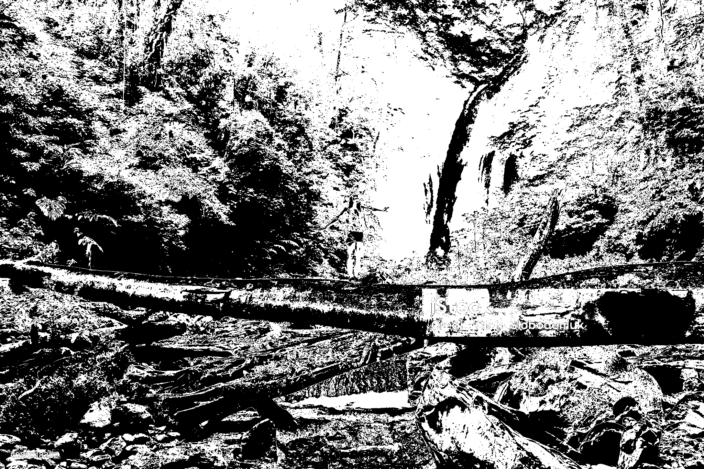
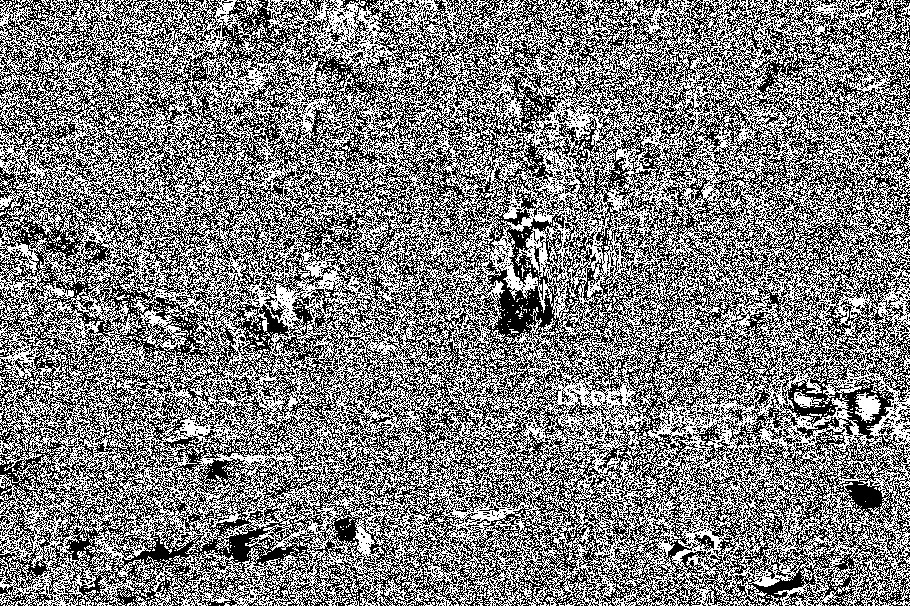
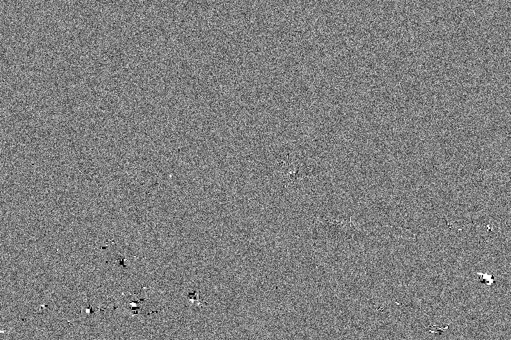
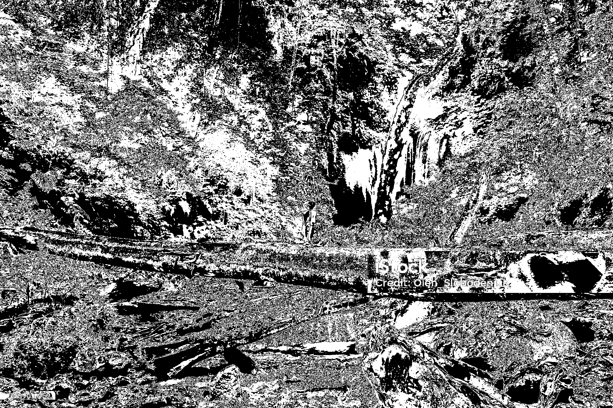
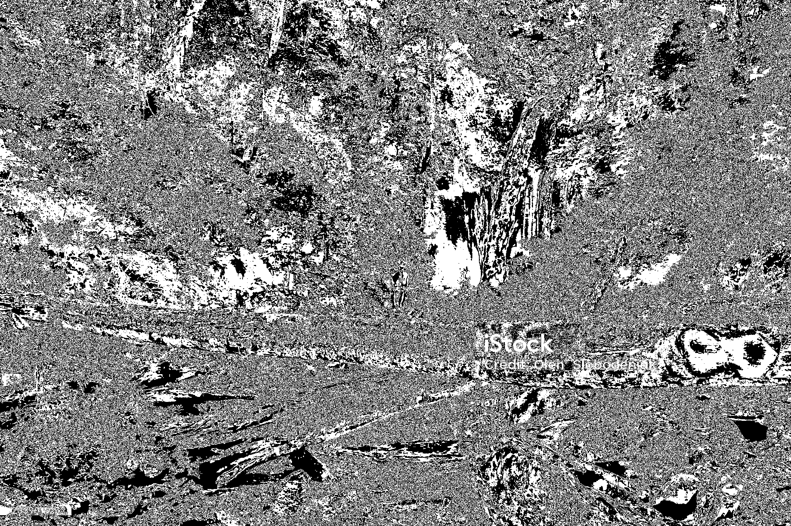
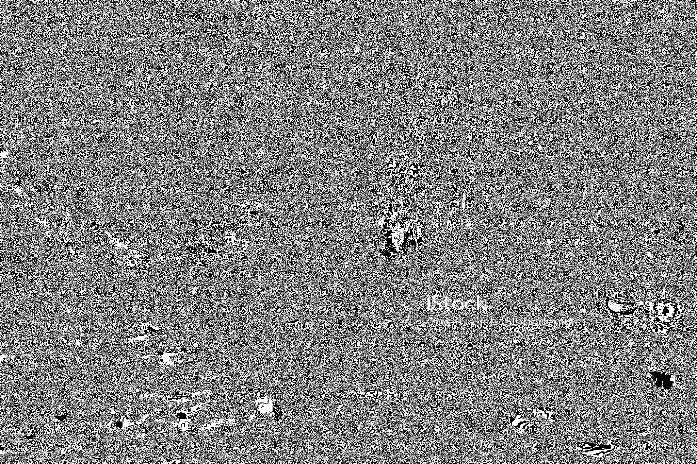
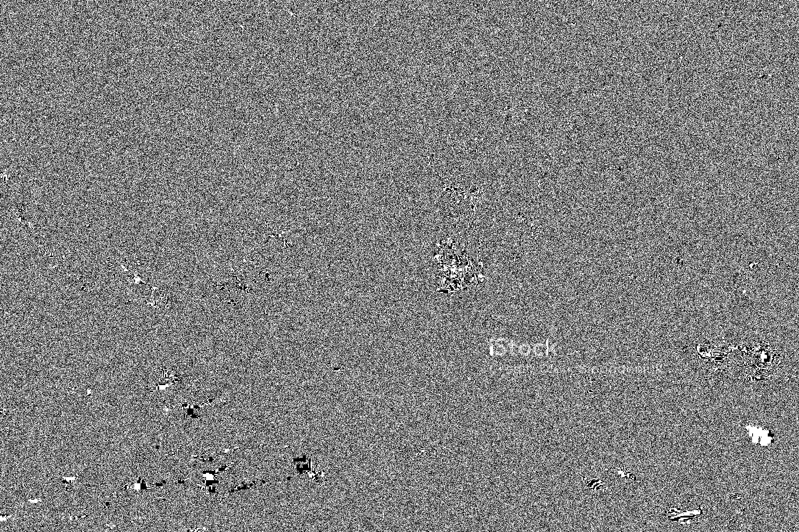

# Image Bit-Plane Slicing (MATLAB)

A MATLAB GUI application for visualising the eight bit planes of an image. The project converts an uploaded image to 8-bit grayscale, extracts bit positions **7 to 0**, displays them in a 2 × 4 layout, and lets the user save each plane separately.

## What is bit-plane slicing?

Every pixel in an 8-bit grayscale image has an intensity from 0 to 255. That intensity can be represented by eight binary bits:

```text
Bit position:  7 6 5 4 3 2 1 0
Significance:  high ----------------> low
```

Bit-plane slicing separates an image into eight binary images. A white pixel means the selected bit is `1`; a black pixel means it is `0`.

For each pixel value `I`, the plane at bit position `b` is calculated as:

```text
P_b = (I >> b) & 1
```

In this project, MATLAB implements it with:

```matlab
binaryPlane = bitand(bitshift(grayImage, -bitPosition), 1);
displayPlane = uint8(binaryPlane * 255);
```

## Features

- Upload **JPG, JPEG, PNG,** or **BMP** images
- Preview the original image
- Automatically convert RGB images to grayscale
- Generate all eight planes, from **Bit Plane 7 (MSB)** to **Bit Plane 0 (LSB)**
- View the planes together in a 2 × 4 grid
- Save any generated plane as PNG or JPEG
- Reset the application and start again

## Project structure

```text
bitslicing/
├── ImageBitPlaneSlicing.m                 # MATLAB GUI source code
├── sample-images/
│   └── istockphoto-2089018252-2048x2048.jpg
├── bit-planes/
│   ├── Bit_Plane_7.png                    # Most significant bit plane
│   ├── Bit_Plane_6.png
│   ├── Bit_Plane_5.png
│   ├── Bit_Plane_4.png
│   ├── Bit_Plane_3.png
│   ├── Bit_Plane_2.png
│   └── Bit_Plane_1.png
└── README.md
```

> Bit Plane 0 is generated by the application; it is not included in the current saved-results folder.

## Requirements

- MATLAB with App Building/UI support (`uifigure`, `uiaxes`, `uigridlayout`)
- Image Processing Toolbox (`rgb2gray`, `im2uint8`, `imshow`)

## Run the application

1. Clone or download this repository.
2. Open MATLAB and set the current folder to `bitslicing`.
3. Run the following command:

   ```matlab
   ImageBitPlaneSlicing
   ```

4. Click **Upload Image** and choose an image.
5. Click **Generate Bit Planes**.
6. Use the corresponding **Save Bit Plane** button to export a result.

## Sample input

The included sample is a 2048 × 1365 colour photograph of a waterfall in a forest. It is converted to grayscale internally before bit-plane extraction.


## Generated results

The saved outputs show how visual information is distributed across bit positions:

| Plane | Observation in this sample |
| --- | --- |
| **Bit 7 (MSB)** | Preserves the strongest visible structure: the waterfall, trees, log, rocks, and human figure remain recognisable. |
| **Bit 6–5** | Contain important tonal transitions and additional scene detail. |
| **Bit 4–2** | Show progressively finer texture, foliage detail, and more fragmented patterns. |
| **Bit 1–0 (LSB)** | Mostly contain subtle intensity variation and noise-like fine detail; the full scene is much less recognisable. |

| Bit Plane 7 (MSB) | Bit Plane 4 | Bit Plane 1 |
| --- | --- | --- |
|  |  |  |

All available generated planes:

| Bit 7 | Bit 6 | Bit 5 | Bit 4 |
| --- | --- | --- | --- |
|  |  |  |  |

| Bit 3 | Bit 2 | Bit 1 |
| --- | --- | --- |
|  |  |  |

## Notes

- The displayed planes are binary: `0` is shown as black and `1` as white.
- Higher-order planes generally carry more visually significant image information than lower-order planes.
- The sample image contains an iStock watermark and is included only to demonstrate the processing output. Ensure that you have the appropriate licence before reusing or distributing it outside this educational project.

## License

No licence file is currently included. Add a licence (for example, MIT) before distributing the code for reuse.
