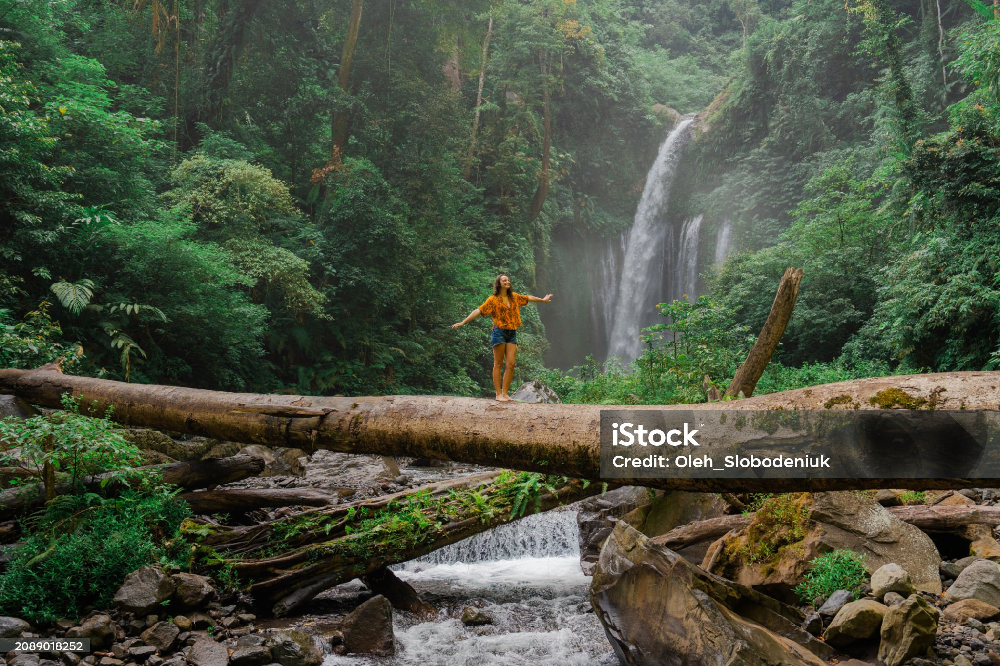
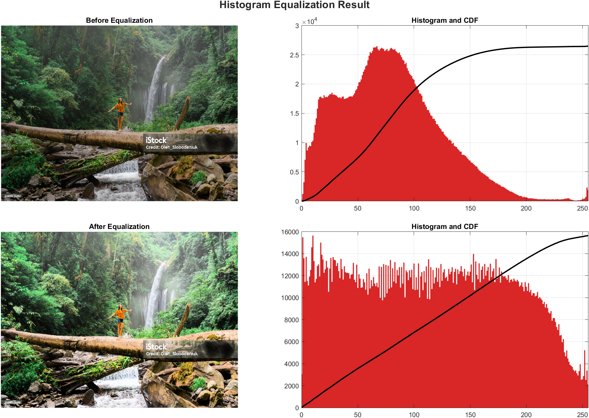

# Histogram Equalization — MATLAB App

A desktop MATLAB application for improving image contrast through histogram equalization. It provides an interactive interface to load an image, compare the original and equalized results, and inspect their histograms and cumulative distribution functions (CDFs).

## Features

- Load PNG, JPEG, BMP, and TIFF images
- Equalize grayscale images using a CDF-based lookup table
- Equalize colour images by processing the Value channel in HSV space
- Compare original and equalized images side by side
- View the histogram and CDF for each image
- Save either the equalized image or a complete comparison output

## Requirements

- MATLAB R2020a or later (recommended)
- Image Processing Toolbox

## Run the app

1. Open MATLAB and change to this directory.
2. Run:

   ```matlab
   histogram_equalization_app
   ```

3. Select **Upload Image**, then choose **Equalize Histogram**.

## Project structure

```text
histogram_equalization/
├── histogram_equalization_app.m  # Application source code
├── README.md                     # Project documentation
└── .gitignore                    # Local MATLAB/output exclusions
```

## How it works

For grayscale images, the app calculates the image histogram, forms its cumulative distribution function, and maps pixel intensities across the available range. For colour images, it applies the same method to the HSV Value channel so hue and saturation are retained.

## Results

Histogram equalization improves the visibility of detail in low-contrast images by spreading frequently clustered pixel intensities across a broader range.

| Aspect | Original image | Equalized image |
| --- | --- | --- |
| Contrast | Detail may be compressed into a narrow tonal range. | Tonal values are redistributed for stronger contrast. |
| Histogram | Often concentrated in a limited intensity range. | Spread more broadly across the 0-255 range. |
| CDF | May contain steep regions where intensities are clustered. | Becomes smoother after intensity remapping. |
| Colour images | Original hue, saturation, and brightness are preserved. | Only the HSV Value channel is equalized, retaining natural colours. |

After processing, the app presents the original and equalized images alongside their histogram/CDF plots. This makes the contrast improvement and the underlying intensity redistribution easy to evaluate at a glance.

### Visual comparison

**Input image**



**Equalized output**


**Complete analysis output**

The complete export compares the original and equalized images with their corresponding histogram and CDF plots.



### Save a result

Use **Save Equalized Image** to export the processed image, or **Save Full Output** to create a four-panel comparison containing the original image, original histogram, equalized image, and equalized histogram.

## License

No license has been selected yet. Add one before publishing if you want to grant others reuse permissions.
